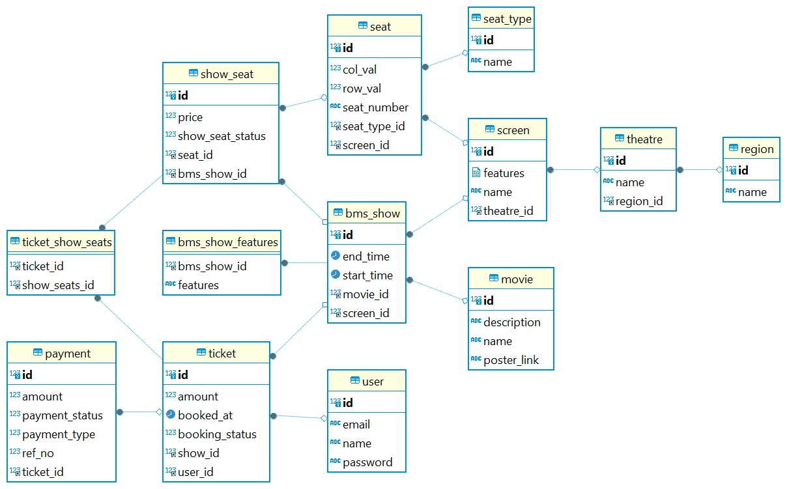

# Low Level Design - Book My Show

### Introduction
This repository contains the low level design (LLD) implementation of an online movie ticket booking system like BookMyShow

### Requirements & Setup

Requirements to run this program are :

- Java 17
- Maven 
- MySQl Db

### Running the application locally
- Clone this repository
- In `resources/application.properties` replace the database credential
- spring.datasource.url = MYSQL_URL
    - e.g. jdbc:mysql://localhost:3306/bookmyshow
- spring.datasource.driver-class-name=com.mysql.cj.jdbc.Driver
- spring.datasource.username=DB_USERNAME
- spring.datasource.password=DB_PASSWORD

### Requirement

- BMS is avaliable in lot of cities and User should able to choose the city.
- User should able to book the ticket.
- User can choose Movie, Theatre, Show, Seat and make Payment.
- Each Theatre have many Screen, at each Screen will show diff Movie at the same time.
- Show is a movie playing at particular time, particular audi, in a particular Theatre.
- User should able to see all the Movie in particular region.
- When User choose the movie, User should able to see all the Shows of that Movie.
- In one booking User can book upto 10 seat.
- No 2 User should able to book same Seat.
- Price will depend on 2 things - Show + SeatType
- Payment should be handle by 3rd party, we need to store the ref id, Payment Gateway and Status.
- User can cancel their boooking as well.
- We Want to support partial payment.

### Class Diagram

### ER Diagram

### End Point - API

| Endpoint                                                                        | Method | Description                                         |
|---------------------------------------------------------------------------------|--------|-----------------------------------------------------|
| `/region`                                                                       | POST   | Add New region                                      |
| `/region`                                                                       | GET    | Get ALl regions                                     |
| `/region/{regionId}`                                                            | GET    | Get region by ID                                    |
| `/region/{regionId}/theatre`                                                    | GET    | Get all theatre in particular region                |
| `/theatre`                                                                      | PUT    | Add New theatre                                     |
| `/theatre`                                                                      | GET    | Get ALl theatre                                     |
| `/theatre/{theatreId}`                                                          | GET    | Get theatre by ID                                   |
| `/"region/{regionId}/theatre/{theatreId}`                                       | GET    | Get particular theatre in particular region         |
| `/movie`                                                                        | PUT    | Add New movie                                       |
| `/movie`                                                                        | GET    | Get ALl movie                                       |
| `/movie/{movieId}`                                                              | GET    | Get ALl movie                                       |
| `/region/{regionId}/theatre/{theatreId}/movie`                                  | GET    | Get all movie in particular theatre                 |
| `/region/{regionId}/theatre/{theatreId}/movie/{movieId}`                        | GET    | Get all movie in particular theatre                 |
| `/region/{regionId}/theatre/{theatreId}/movie/{movieId}/show`                   | GET    | Get all movie in particular theatre                 |
| `/region/{regionId}/theatre/{theatreId}/movie/{movieId}/show/{showId}/showseat` | GET    | Get all movie in particular theatre                 |
| `user/{userId}/ticket`                                                          | GET    | Get all ticket which is booked by particular user   |

